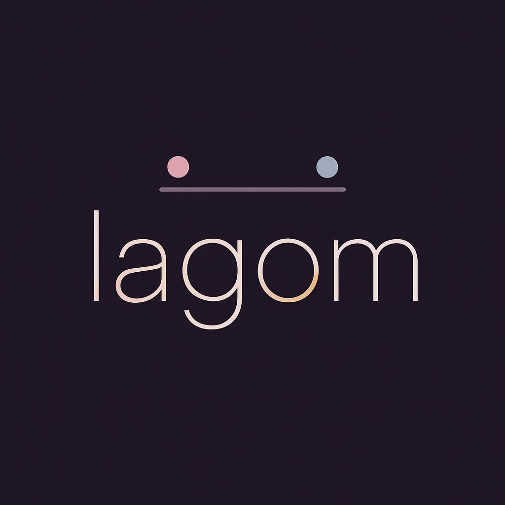

<div align="center" width="200px" height="100px">
    
</div>

<hr style="width:40%;">

## Gallery 📸
 - will_add_some_images_soon<sup>TM</sup>

## What is this? 📖
These are my personal dotfiles. It uses the [Matugen](https://github.com/InioX/matugen) to sprinkle some color.

Basic information :

  • **OS**: Arch Linux, duh! <br>
  • **Window Manager / Compositor**: [Hyprland](https://github.com/hyprwm/Hyprland) <br>
  • **Status Bar**: [Waybar](https://github.com/Alexays/Waybar) <br>
  • **Notifications**: [dunst](https://github.com/dunst-project/dunst) <br>
  • **Terminal**: [kitty](https://github.com/kovidgoyal/kitty) <br>
  • **Launcher**: [rofi](https://github.com/davatorium/rofi/) <br>
  • **Prompt**: [starship](https://github.com/starship/starship) <br>


## You want this? 🔧
> [!NOTE]
> The packages listed are for arch. Depending on your distribution, the names of the packages below may slightly differ. Also, some of the packages might not be available in your distribution's repositories so you might have to build them from source.
> I am working on a script for easier replication. But... it will take some time and trial and error.
> Sometimes I might nuke most configs here and go for a widget system like Quickshell.

1. **Clone the repo & Apply configs:**
    ```sh
    git clone https://github.com/5yndr0m/Lagom.git
    cd Lagom
    cp -r config/ ~/.config
    ```

2. **I will add the rest soon.**

## Contributions 📝

- **Pull requests**: Pull requests for bug fixes or README improvements are welcome. However, before starting work on a pull request for a new feature, please open an issue so we can discuss about it first.

## Special Thanks 🫂
• here are many repos I got inspirations and code snippets. Thank you all. I will add special mentions soon.
