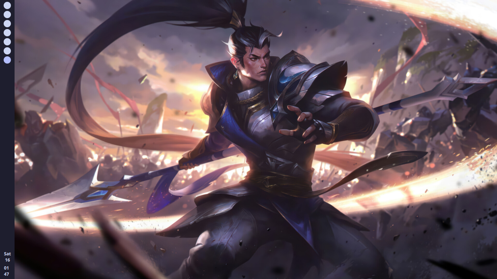
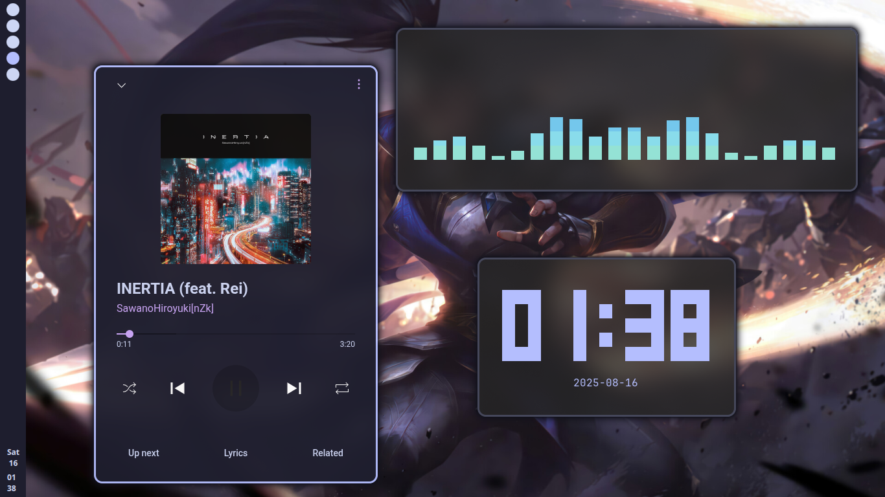
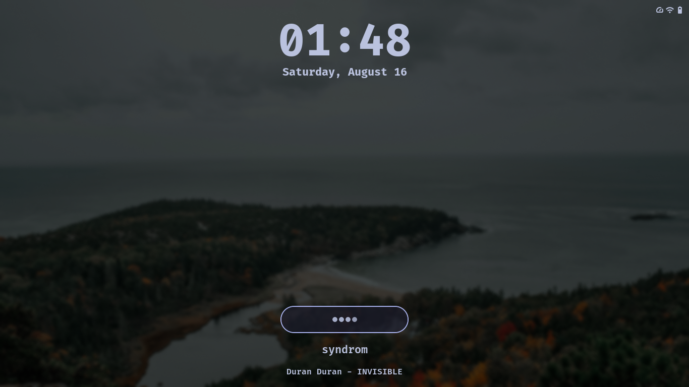
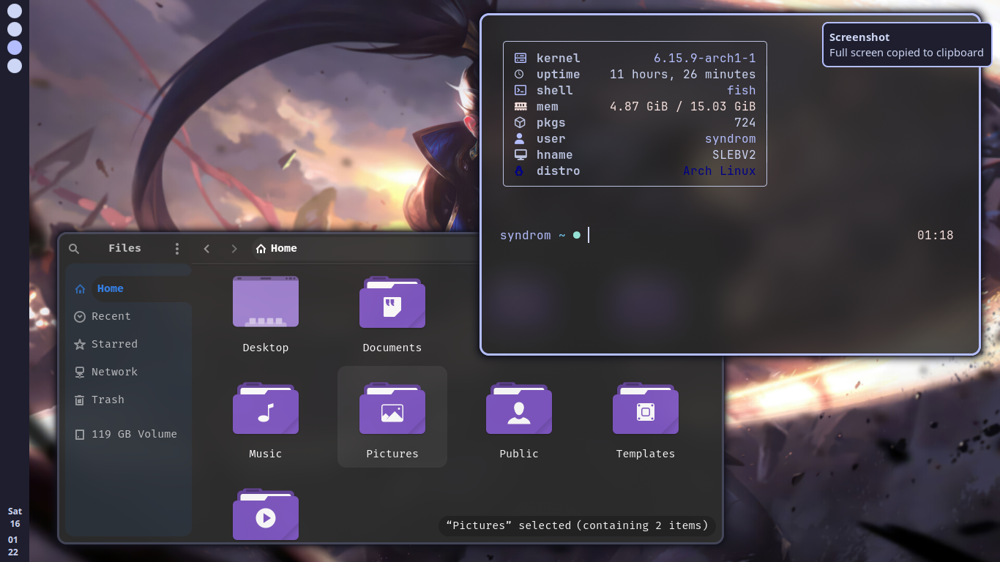
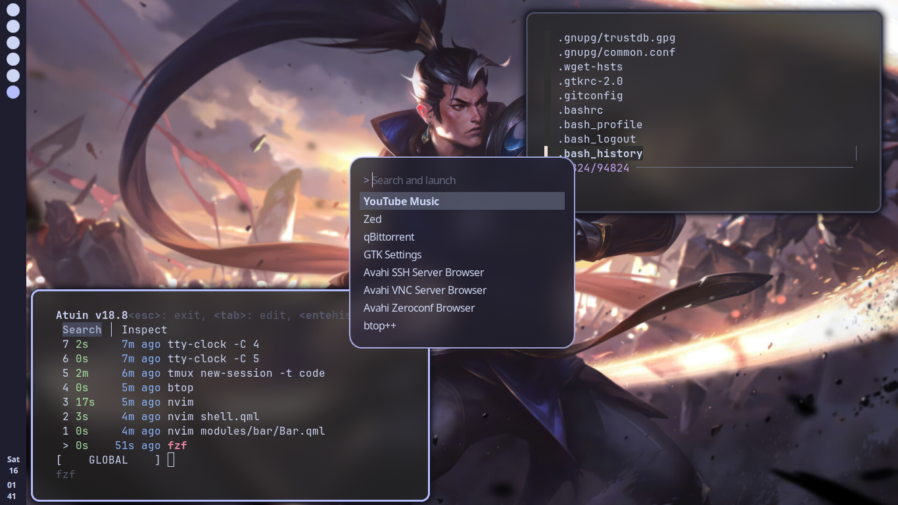
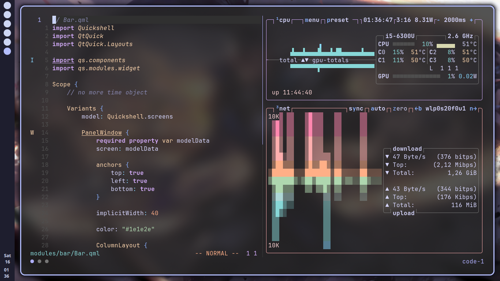
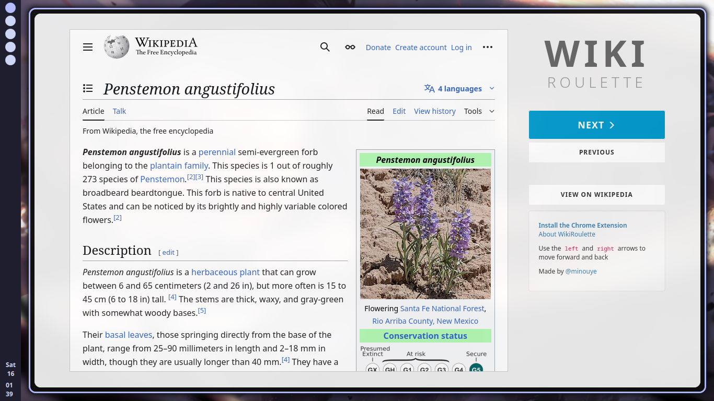
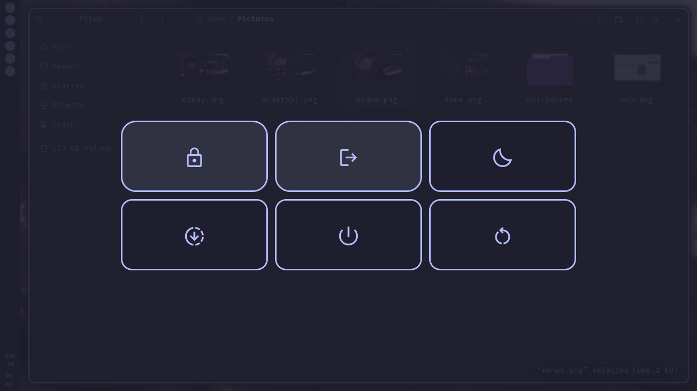
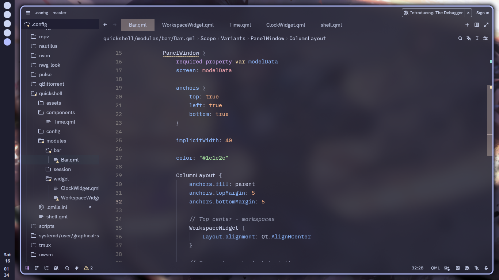

> [!IMPORTANT]
> **Development Branch**: Things are broken here. I'm redoing my Quickshell setup. Be warned....
# dottedDotfiles ✨

> My personal dotfiles collection for a beautiful, minimal, and functional Arch Linux + Hyprland setup with Catppuccin Mocha theme

<div align="center">


</div>

## 📸 Gallery
### Things might not exactly look like in the images

| Desktop | Eye candy | Lock Screen |
|---------|-------------|-------------|
|  |  |  |
| *WIP QuickShell Bar* | *Some Eye Candy* | *Hyprlock* |

| Explorer & Terminal | Menus | Tmux, Neovim & Btop |
|---------|-------------|-------------|
|  |  |  |
| *Qrchis Purple theme & Transparent Terminal* | *Fuzzel, Atuin, & fzf* | *Tmmux, Neovim, & Btop* |

| Zen Browser | Wlogout | Zed editor |
|---------|-------------|-------------|
|  |  |  |
| *Zen Browser Compact mode* | *Wlogout* | *Zed editor * |

---

## 🖥️ System Information

<details open>
<summary><b>Core Components</b></summary>

| Component | Application |
|-----------|-------------|
| **OS** | Arch Linux |
| **Compositor** | [Hyprland](https://github.com/hyprwm/Hyprland) |
| **Session Manager** | [UWSM](https://github.com/Vladimir-csp/uwsm) |
| **Status Bar & Widgets** | [QuickShell](https://github.com/quickshell-org/quickshell) |
| **Launcher** | [Fuzzel](https://codeberg.org/dnkl/fuzzel) |
| **Terminal** | [Foot](https://codeberg.org/dnkl/foot) |
| **Lock Screen** | [Hyprlock](https://github.com/hyprwm/hyprlock) |
| **Logout Menu** | [Wlogout](https://github.com/ArtsyMacaw/wlogout) |
| **File Manager** | [Nautilus](https://gitlab.gnome.org/GNOME/nautilus) |
| **Wallpaper Manager** | [Waypaper](https://github.com/anufrievroman/waypaper) |

</details>

<details>
<summary><b>Development & Productivity</b></summary>

| Category | Applications |
|----------|-------------|
| **Editors** | [Neovim](https://github.com/neovim/neovim), [Zed](https://github.com/zed-industries/zed) |
| **Browser** | [Zen Browser](https://github.com/zen-browser/desktop) |
| **Terminal Multiplexer** | [Tmux](https://github.com/tmux/tmux) |
| **Shell** | [Fish](https://github.com/fish-shell/fish-shell) + [Bash](https://www.gnu.org/software/bash/) |
| **Fuzzy Finder** | [fzf](https://github.com/junegunn/fzf) |
| **History** | [Atuin](https://github.com/atuinsh/atuin) |

</details>

<details>
<summary><b>System Monitoring & Audio</b></summary>

| Purpose | Application |
|---------|-------------|
| **System Monitor** | [btop](https://github.com/aristocratos/btop) |
| **Audio Visualizer** | [Cava](https://github.com/karlstav/cava) |

</details>

## 🎨 Theme

This setup uses the **Catppuccin Mocha** colorscheme throughout most applications for a cohesive and elegant dark theme experience and I have placed much emphasis on lavender color than others :)

---

## 🚀 Installation

> [!WARNING]
> **Work in Progress**: This configuration is tailored to my specific setup and preferences. It may require adjustments for your system.

### Prerequisites

Ensure you have a functional Hyprland setup with all hypr ecosystem packages:

```bash
sudo pacman -S uwsm quickshell fuzzel foot hyprlock wlogout bob neovim zed nautilus tmux fish fzf atuin btop cava

yay -S zen-browser-bin waypaper-git
```

### Get Neovim Nightly (0.12.+)
```bash
bob install nightly
bob use nightly
```

### Quick Setup

1. **Clone the repository:**
   ```bash
   git clone https://github.com/5yndr0m/dottedDotfiles.git
   cd dottedDotfiles
   ```

2. **Backup your existing configs:**
   ```bash
   mkdir -p ~/dotfiles-backup
   cp -r ~/.config ~/dotfiles-backup/
   ```

3. **Apply configurations:**
   ```bash
   # Method 1: Direct copy (simple)
   cp -r config/* ~/.config/
   ```

4. **Restart Hyprland or reboot**

> [!NOTE]
> A comprehensive installation script is in development for easier deployment across different systems.

---

🚧 To-Do List
Current development priorities and planned features:
<details open>
<summary><b>🎛️ Status Bar (QuickShell) Improvements</b></summary>

 Volume Indicator - Audio level display with popup controls
 Battery Indicator - Power status with percentage and charging state
 Enhanced Date - Better formatting
 System Tray - Application tray integration

</details>
<details open>
<summary><b>🎵 Media & Interface</b></summary>

 Music Controls - Media player integration with play/pause/skip
 Lock Screen - Custom lock configuration and styling
 Session Management
 Notifications History Manager

</details>


<details open>
<summary><b>These things are done</b></summary>

 Workspaces
 Active Window Name/Title
 OSD (On-Screen Display) - Volume, and brightness overlays
 Notifications 
 Enhanced Time - Better formatting

</details>

---

## 🤝 Contributing

Contributions are welcome! Here's how you can help:

- **🐛 Bug Reports**: Found an issue? Please open an issue with details
- **📝 Documentation**: README improvements and configuration documentation
- **🔧 QuickShell Help**: Especially looking for guidance and contributions for QuickShell configurations
- **💡 Feature Suggestions**: Open an issue to discuss new features before implementing

### Pull Request Guidelines

1. Fork the repository
2. Create a feature branch (`git checkout -b feature/amazing-feature`)
3. Test your changes thoroughly
4. Submit a pull request with a clear description

---

## 💝 Acknowledgments

Special thanks to these amazing projects and creators for inspiration, code snippets, and guidance:

- **[end-4/dots-hyprland](https://github.com/end-4/dots-hyprland)** - Incredible Hyprland setup inspiration
- **[caelestia-dots/caelestia](https://github.com/caelestia-dots/caelestia)** - Beautiful aesthetic references
- **[codingjerk/dotfiles](https://github.com/codingjerk/dotfiles)** - Clean configuration structure
- **AI Chatbots** - For troubleshooting and configuration assistance
- **Hyprland Community** - For the amazing Configurations and continuous support
- **Catppuccin Team** - For the beautiful color palette

---

## 📄 License

This project is licensed under the GNU License - see the [LICENSE](LICENSE) file for details.

---

<div align="center">

**⭐ If you found this helpful, consider giving it a star!**

*Made with ❤️ on Arch Linux*

</div>
